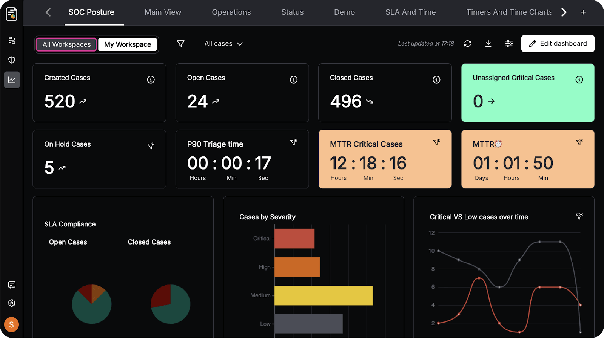

Whenever most people think of the word “hacking” and "cybersecurity," they often picture a masked and hooded figure in a dark room with green text scrolling across a dark screen. Well, that image comes from films and TV shows that are depicting it wrong and compressing weeks of technical knowledge into a few seconds of visuals. Most attacks and defenses involve research, planning, testing, documentation, and coordination rather than frantic typing or instant access. Now you may ask yourself, how so?

#### Brief History

The word “hack” has been floating around for a while, with it being used as early as the 1950s at the [MIT Tech Model Railroad Club](https://tmrc.mit.edu/), when it originally referred to devising a clever solution to a technical problem. However, over time, it developed into nouns like “hacker” to describe someone deeply curious about how computers worked and how to push them beyond their limits.

In the 1960s and 1970s, this culture expanded within university labs and computing communities, where “hacking” was closely tied to experimentation and collaborative problem-solving. As personal computers and early networks emerged in the 1980s and 1990s, the word's meaning began to shift. Within technical communities, a hacker was still someone skilled and inventive but in mainstream media, the word started becoming linked to cybercrime.

By the early 2000s, as large-scale cyberattacks began to rise and internet connectivity became widespread, public perception continued to shift. Hacking became commonly associated with data theft and criminal activity, even though the original meaning centered on technical exploration.

#### What Cybersecurity Actually Looks Like

For the typical internet user, cybersecurity usually means practical habits that involve creating strong, unique passwords, enabling multi-factor authentication on your social media accounts, avoiding suspicious links, and limiting the amount of personal information being shared online. This is definitely true, as many successful cybersecurity attacks rely on weak account credentials, reused passwords, or phishing emails.Resources like the [CISA Secure Our World guide](https://www.cisa.gov/secure-our-world) outline these exact fundamentals. But if we try to apply this perception of cybersecurity to an organizational level or industry-wide, the scope of knowledge expands significantly. 

When you scale it up to the organizational level, cybersecurity becomes more than just clicking on passwords and making sure you have a complex password. It is a combination of people, processes, and technology specifically designed to reduce cybersecurity risk: the potential for loss or disruption to an organization due to a cybersecurity threat. Instead of being a single team or set of tools, it is a function embedded in the company that continues to better itself over time. Frameworks such as the [NIST Cybersecurity Framework](https://www.nist.gov/cyberframework) provide structured guidance on how organizations manage this risk.

To put it in a very broad way, ethical cybersecurity is split into two teams: blue and red.

Blue teamers are the professionals who focus on defending an organization from cybersecurity threats. They use different tools to monitor systems, look at logs, configure security settings, and respond to security incidents. This kind of work usually happens in what is known as a Security Operations Center or SOC for short, and in many cases, they are often ran 24/7 since cybersecurity threats can occur from anywhere in the world. Inside a SOC, these professional analysts will typically have access to a majority of the information that moves across the organization so any websites you are visiting, any files you’re transferring or downloading, are all tracked. All of this information is fed into this software called a Security Incident and Event Management tool, also known as SIEM and all it allows the blue team to centralize all this information, analyze it, and respond to potentially malicious behavior.

*Figure 1: Image depicting a SOC dashboard example*

On the other hand, the red team refers to cybersecurity professionals that try to perform permitted cybersecurity attacks (also known as [pentesting](https://www.sans.org/information-security-glossary/what-is-penetration-testing/)) on an organization to simulate how an actual cybersecurity threat would try to hack the infrastructure. They are often given permission by the company to try to bypass defenses, attempt phishing campaigns, or even perform physical breaches of the company premises. However, instead of trying to purposefully harm the company, they are hired to provide insight to the company on what cybersecurity vulnerabilities they may have and should work on, which ultimately helps these organizations know what to improve on so they are less likely to be a victim of a cybersecurity attack in the future. While they share different goals and processes from the blue team, both the red team and blue team work together to increase the security posture (known as cybersecurity strength) of the organization.

Of course, cybersecurity isn’t just limited to a dedicated blue and red team. The entire organization is part of the overall cybersecurity effort. For example, security teams often work together with the IT team to help respond to cybersecurity incidents, they may ask them to reset a user’s password, make a security configuration change on the company’s network, or purge all of the emails belonging to a phishing campaign. Another case would be the legal team which would be heavily involved if a cybersecurity threat was successfully able to break into the company network and steal data. Lastly, the typical user or even executive board is responsible for maintaining strong cybersecurity awareness, tying back to the concept of strong passwords and recognizing phishing attempts.

Outside of the professional security teams, we can talk about the cybersecurity threats, the actual threats that you once believed were the hooded figures typing in front of a dark screen. These threats, also known as threat actors, can be classified into different categories. Cybercriminals are those who are primarily motivated by financial gain and they often distribute ransomware, create fraud, and steal credentials to create profit. There are also "hacktivists" who are individuals that are politically motivated to carry out cybercrime and typically they aim to cause reputational damage or bring awareness to some cause. You also have the script-kiddie, who is an inexperienced individual with very little resources and relies on pre-built tools or publicly available malware to carry out cybersecurity attacks without understanding how they work. Lastly, we have nation state threat actors and they are often referred to as Advanced Persistent Threats. These are organizations of highly sophisticated individuals who have many resources and complex techniques to carry out cybersecurity attacks and they are often sponsored by a government entity to cause digital damage or gain long term access to a targeted network.  

#### The role of Risk and Human Error

Another misconception is that cybersecurity breaches happen because a hacker typed a bunch of words and sophisticated code really fast on a terminal to break into a network. However, in reality, many cybersecurity incidents happen because of something simple. For example, data breaches can happen because of exposed cloud storages, overly permissive access controls, unpatched software, and employees falling for phishing attempts. You would be surprised at how many cybersecurity incidents happen because of simple things like this.

For example, in October 2016, attackers were successfully able to breach Uber’s Amazon S3 datastore and this allowed them to steal tons of users’ personal information, of which were about 600,000 U.S driver license numbers. The catch? They were able to access this information because there were hardcoded AWS keys (like passwords, but for a service) hardcoded in a private github repository.

<iframe 
  width="560" 
  height="315" 
  src="https://www.youtube.com/embed/gwIEzpS8Mwk" 
  title="Cybersecurity Overview" 
  frameborder="0" 
  allow="accelerometer; autoplay; clipboard-write; encrypted-media; gyroscope; picture-in-picture" 
  allowfullscreen>
</iframe>

#### Summary

At the end of the day, it is rather apparent that the popular image of hacking-that being fast typing and instant access-is largely fictional. In the real world, cybersecurity (when done right) is structured, process-driven, and risk-focused. Although at the individual level it still encompasses simple means like good password practices and phishing, cybersecurity is more than just that when it comes to scaling up to the size of an organization and is a collaborative effort driven by different individuals and teams.