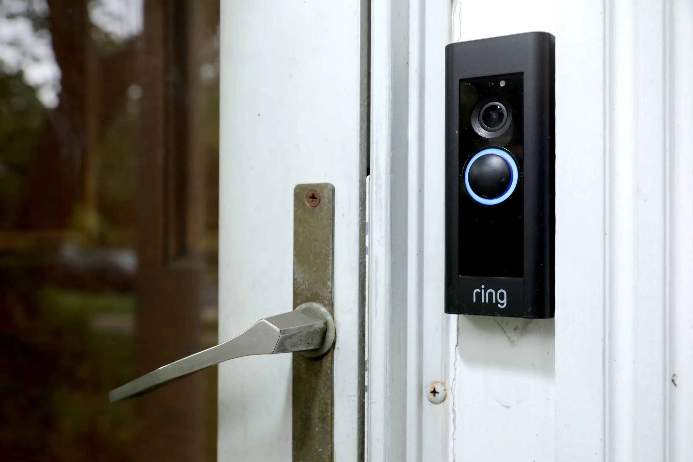

Do you own any smart devices at home? Or have you watched any tech YouTubers talk about their smart home setups? What if your smart thermostat is secretly spying on you?

The development of smart home devices has changed the way we interact with our homes. Devices such as security cameras, voice assistants, smart thermostats, and more are designed to improve the efficiency and convenience of daily life. However, smart homes can also come with a cost: cybersecurity. They increase the risk of a cybersecurity attack, which highlights the fact that being smart does not necessarily mean being secure.

#### Introduction to IoT

Whenever we think of smart devices, we think of anything related to the Internet of Things or IoT for short. Simply put, IoT refers to any physical object that has sensors, software, or technology that allows it to connect to the internet or some large network to exchange data. These devices are usually designed to serve a dedicated purpose so something like a laptop or computer does not typically count as IoT. However, examples such as smart speakers, ring doorbells, smart fridges, and smart locks can belong to the internet of things.

<iframe width="560" height="315"
    src="https://www.youtube.com/embed/6mBO2vqLv38"
    title="YouTube video player"
    frameborder="0"
    allow="accelerometer; autoplay; clipboard-write; encrypted-media; gyroscope; picture-in-picture; web-share"
    allowfullscreen>
</iframe>

#### The risks

For most people, the risks of having these devices at home do not resemble dramatic cybersecurity breaches. When a compromise does occur, it is often very subtle. A smart device may continue to function normally while quietly being misused in the background.

One major issue is that IoT manufacturers often do not prioritize security when designing these devices. IoT devices are frequently inexpensive, always connected to a network, and rarely maintained properly. Many devices are shipped with default usernames and passwords and firmware updates are often lacking, meaning that when a cybersecurity vulnerability is discovered, there may be no way to fix it. In addition, smart speakers constantly listen for specific wake words to accept commands, and because they store these commands in the cloud, personal information or account activity could potentially be exposed when a cybersecurity breach occurs in the cloud.

Furthermore, if a device is exposed to the internet and has a vulnerability, attackers can use it to participate in a larger cyberattack known as a (botnet)[https://www.paloaltonetworks.com/cyberpedia/what-is-botnet]. A botnet is a network of many compromised devices controlled remotely to carry out a coordinated attack. In this case, your thermostat could be used maliciously to target a corporate website that you were never even affiliated with.

One clear example is the [Mirai botnet](https://www.cloudflare.com/learning/ddos/glossary/mirai-botnet/) in 2016 where threat actors scanned the internet for specific smart devices still using default usernames and passwords. They then infected those devices and controlled them remotely to launch large-scale distributed denial-of-service attacks against major websites. From the device owner’s perspective, the devices continued to work normally, and there were no obvious signs of compromise.

<iframe width="560" height="315" 
    src="https://www.youtube.com/embed/KKSyB476n9o" 
    title="YouTube video player" 
    frameborder="0" 
    allow="accelerometer; autoplay; clipboard-write; encrypted-media; gyroscope; picture-in-picture; web-share" 
    allowfullscreen>
</iframe>

Detecting compromised devices in a typical home is difficult as there could be a multitude of signs that may or may not appear as legitimate. Possible indicators include slow internet speeds, unknown devices appearing on your router, cameras activating without input, or sudden account issues. However at the same time, these could also be false positives due to software errors or bad connections. Many infected devices, however, show no symptoms at all. Unlike laptops or smartphones, most IoT devices lack cybersecurity protection, do not record logs, and do not provide user-facing alerts so detecting an infection is rather difficult.

#### Defending against these risks

[Network segmentation](https://www.cisco.com/site/us/en/learn/topics/security/what-is-network-segmentation.html) is one practical mitigation that many people can do to reduce the risks that come with IoT devices. Many home routers allow you to create a guest network and connecting all your smart devices on that separate network reduces the risk of an attacker being able to gain access to other devices on your home network. If a smart TV or camera is compromised, it becomes much more difficult for an attacker to access sensitive devices such as your personal workstation. This does not eliminate the risk, but it limits the potential damage that could come with your smart devices being compromised.

The security implications are not only digital as smart locks, garage door openers, security cameras, and baby monitors are often used in consumer homes and if compromised would lead to physical security risks. For example, if your smart lock was compromised, would you feel safe knowing that there is someone out there in the world who is able to unlock your door remotely? Or would you be comfortable knowing that there is someone in a different country who can remotely spy on you anytime they wish?

When it comes to protecting yourself, reducing the risk does not require advanced techniques as long as you're taking steps in the right direction. Simple steps such as changing default usernames and passwords, using strong passwords, updating firmware when available, and placing devices on a dedicated guest network are effective ways to mitigate these risks.
#### Summary

At the end of the day, it is true that smart homes increases convenience by a significant amount but at the same time it also increases the attack surface that an attacker can leverage to get into your network. Each connected device is another entry point and how much caution you take in mitigating these cybersecurity risks plays a role in your assurance.
